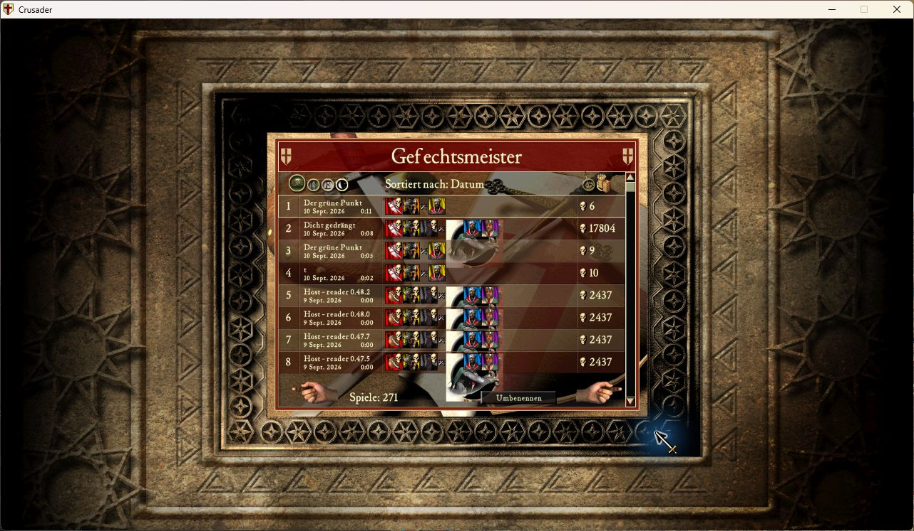
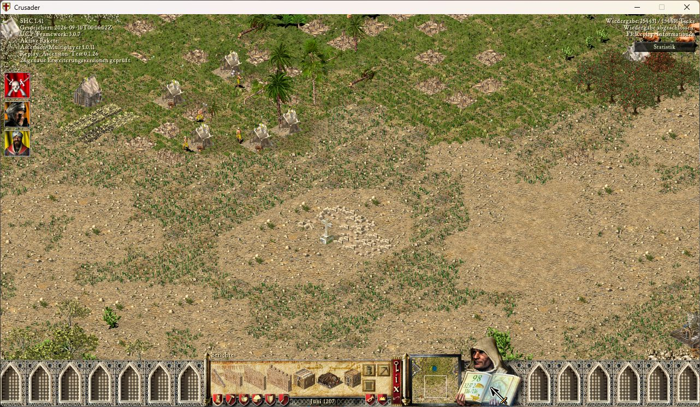

# Replay menus and player views

Recordings appear beside existing results in the native single-player Skirmish
battle history. The default ordering is newest saved time first: a named
snapshot uses its save time, and a full recording uses the match-end save time.
The original date heading, sorting controls and scrolling remain in use.
Unnamed recordings keep the map name. Existing game results remain unchanged.

Click once to select a row; click the selected row again to open its native
statistics. A selection outline shows which entry the controls apply to.
Only recordings offer **Rename** (also F2) and the right-pointing **Watch replay**
hand. Statistics screens keep their native navigation and have no replay overlay.

Clicking Watch replay verifies the recording while keeping the history screen
visible. Progress appears there; leaving cancels preparation. Playback starts
only after verification succeeds. A required settings restart is reported
separately and preserves the normal configuration.

During a match, **Escape > Save replay** saves a separately named snapshot while
the full recording continues. The compact name editor has Save and Cancel,
with an inline error only when saving fails. Normal mission exit saves the full
recording. An abrupt crash preserves files but does not guarantee a playable prefix.

During playback, portraits on the left select whose reports/book to inspect.
The progress bar and adjacent tick counter stay at the top right, with status
below. Progress is sampled four times per second; completion updates immediately.
The bar reuses the native loading-bar fill and palette on the existing gameplay
overlay surface. It is currently display-only: clicking does not seek.
F3 adds the saved date,
game and UCP framework versions, and a compact summary of recorded packs.
Full exact settings and asset checks still govern replay admission.
Use the ordinary Escape menu to resume or leave; mission restart is disabled.
The minus/plus buttons and keyboard shortcuts use the native speed handler,
including UCP2-Legacy's installed extended-speed setting. Recorder defines no
independent speed steps or limit. Native speeds from 1100 display as 1000+.
After successful completion, **Statistics** replaces the speed strip and opens
the current recording's existing statistics after the native world-exit cleanup.
Report buttons also remain usable during paused and completed replay playback.

## In-game previews

Captured from the packaged module using the game's German UI. Layout and controls
are shared with the English UI; these are actual game captures, not mockups.

## Language and native fonts

In-game labels use `data.version.getGameLanguage()`, never `UCP_GUI_LANGUAGE`.
Translated installations may retain the original executable's language enum:
once TextManager is ready, its loaded language marker (text group 6, entry 0)
takes priority. The renderer reads it through the existing UI text getter, so
TextResourceModifier replacements are respected. Unknown markers fall back to
the game-language provider, then English; the legacy global game provider is
used only when `data.version` has no language API.

English and German are joined by French, Russian, Hungarian, Turkish, Chinese,
Spanish, Persian, Italian and Polish. Each catalog covers all 78 retained labels
and preserves formatting arguments. Catalogs contain UTF-8; conversion uses the
loaded TextManager's codepage, not the Windows system locale or a guessed page
for the selected language. Until TextManager is ready, the original 1252 fallback
applies. Labels that cannot be represented fall back to their English source.
Unrepresentable characters in dynamic values, such as names, become `?`.

`text-encoding.lua` owns conversion and character-safe clipping. It reuses UCP's
native ABI adapter and the Windows conversion functions, with no new DLL, shell
or runtime dependency. Conversions reject invalid UTF-8 and lossy best-fit
substitutions. Windows-1256 has no Persian yeh slot: for this codepage only, the
encoder maps Persian yeh to Arabic yeh, as used by legacy Persian text/fonts.
UTF-8 output retains the original character. See Microsoft's
[conversion flags and default-character rules](https://learn.microsoft.com/en-us/windows/win32/api/stringapiset/nf-stringapiset-widechartomultibyte).

Measurement and drawing use the same encoded bytes and existing native fonts
(18 for controls, 15 for headings). Clipping respects whole characters, including
two-byte Chinese glyphs, and the existing width and buffer bounds. Conversion is
lazy and cached with a fixed limit; it runs in presentation, not simulation.
Only the selected language catalog loads, and a recognized TextManager marker
avoids querying the fallback executable-language provider. HUD shadow and foreground
share one conversion/clipping pass. Labels from the retired standalone menus are
omitted; this does not remove controls from the current native menus.

Automated tests cover all catalogs/placeholders, real Windows codepage conversion,
language priority, fallback, native font selection and multibyte clipping.
The screenshots above predate these additional languages. Visual glyph coverage,
Persian shaping/direction, and clipping in every translated installation remain
live acceptance checks: open battle history, the name editor and replay HUD/F3
at the smallest supported resolution, including long player/map names. Test with
a conflicting launcher language and confirm the game language remains selected.
Conversion success alone does not establish that an installation supplies every
glyph; Recorder reuses its fonts and does not install replacement fonts.

## Validation status

0.48.2 completed fresh named and automatic single-player recordings, followed by
a loaded-save continuation from tick 94,548 to 248,979. Snapshot statistics and
return to history were checked in game. The host capture from one physical Steam
match completed offline on the second PC; its client capture also passed on
0.48.0. These results do not cover repeated multiplayer games or connection loss.

0.48.3 removes the native logical-pause rejection specifically for report actions
71..79 during replay. Original-binary branch checks cover both executable variants;
live acceptance of this correction is tracked separately from playback checks.
